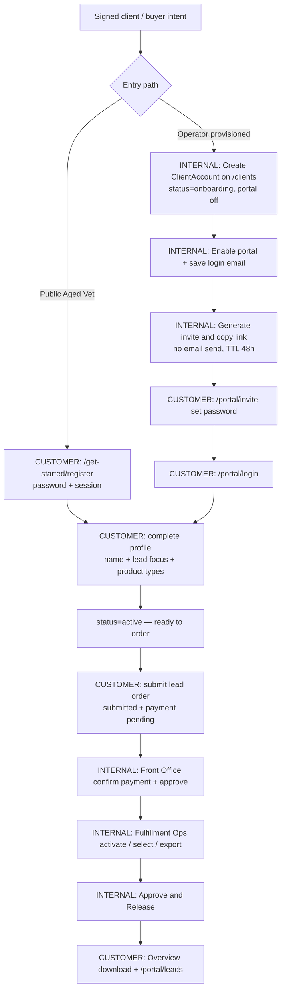

# SA360 Client Onboarding & Account Setup SOP

Audience: Matt, Aaron, customer success, operations, future onboarding staff.

This SOP describes the **current shipped product** as of deploy commit `ee4963f` (API health `commitShort=ee4963f`, matching `origin/master` after #139 aged order options). It is based on a 2026-09-13 walkthrough of:

- the **deployed** customer portal and public Aged Vet Leads pages (read-only on the existing Smart Agent 360 Demo tenant)
- a **local Docker** replica of the same commit for write actions (create client, invite, password setup, public register, order submit, Front Office review)

Walkthrough recording (local write path, no production data): `docs/validation/artifacts/client-onboarding-2026-09-13/sa360-client-onboarding-walkthrough.webm`  
Friction log: `docs/validation/client-onboarding-walkthrough-findings-2026-09-13.md`

It does **not** redesign the flow. Where a step is not implemented, this document says so.

## Purpose

Get a signed Life Agent Launch / SA360 client from “we closed the deal” (or “they found Aged Vet Leads”) to a usable customer portal account, and hand a first lead order to fulfillment — without charging a card in the product, without auto-emailing invites, and without turning on live lead delivery from the Clients screens.

## Definition of Done

A client is fully onboarded when **all** of the following are true:

- [ ] A `ClientAccount` row exists (created in Admin C.O.C. **or** via public `/get-started/register`)
- [ ] Display name / business identity is correct
- [ ] Portal is enabled (`portalEnabled`)
- [ ] Portal login email is set and is the address the customer actually uses
- [ ] Customer has a **per-account password** (invite accept, public register, or password-reset invite) — not only the shared env fallback
- [ ] Customer can sign in at `/portal/login` in a private window
- [ ] Account setup is complete: business name + at least one lead focus + at least one product type
- [ ] Client lifecycle status is **Active / Ready to order** (`status=active`). Completing setup in the portal does this; an operator can also set it on `/clients/[id]`
- [ ] Customer can open Overview, Orders, Leads, and Account
- [ ] If they should be able to buy leads: they can open `/portal/orders/new` (blocked until `status=active`)
- [ ] If a first order was submitted: it shows **submitted** with **payment pending** until Front Office confirms payment and approves
- [ ] GHL / delivery-config is **not** required for portal login or order submit. It **is** required before live CRM delivery; treat that as fulfillment/cutover, not portal onboarding

Optional (do not block “they can use the portal”):

- [ ] Channel Profile / GHL destination saved
- [ ] Delivery mode still `shadow` / delivery disabled until a deliberate live cutover
- [ ] Test login recorded in the handoff notes

## Roles

Only responsibilities the current product actually supports:

| Role | Owns today |
| --- | --- |
| **Sales / Matt** | Close the client. Decide path: public Aged Vet self-serve **or** operator-provisioned invite. Send the invite **link** (copy/paste — the product does not email it). Tell the customer what “payment pending confirmation” means (payment happens **outside** the portal). |
| **Technical / Aaron** | Admin C.O.C. client record, portal enable + login email, invite/re-invite, status corrections, GHL destination / delivery-config when CRM delivery is in scope, diagnose login/invite/tenant mismatches. |
| **Operations / Sam or assigned operator** | Front Office payment confirm + approve. Fulfillment Ops activate, select, export, **Approve & Release**. Do not release production packages “just to demo.” |
| **Customer** | Set password (invite or register). Finish account setup. Sign in. Place order requests. Watch status. Download **released** packages only. |

There is still a **single shared Admin C.O.C. password** (`ADMIN_COC_PASSWORD`), not per-operator Google login. The login screen itself says this is a temporary gate.

## Phase 1 — Sale / Handoff

### 1.1 Decide the customer entry path

**Owner:** Matt (with Aaron if the client is operator-provisioned)  
**System:** None yet — this is a process choice the product now supports two ways.  
**Action:** Pick one:

1. **Public Aged Vet Leads** — customer starts at `/get-started` (deployed on the admin-coc host; marketing hostname is env-driven via `SA360_PUBLIC_MARKETING_HOSTS`, not hard-coded).
2. **Operator-provisioned** — Aaron/Matt create the `ClientAccount`, enable portal, copy an invite link to the customer.

**Expected result:** Customer knows whether they will **Create account** or **open an invite link**.  
**If it fails:** Do not mix paths. Public register creates a **new** `ClientAccount` (`avl` + hex id). An invite belongs to an **existing** row. A customer who already has an invite should use `/portal/invite/...`, not `/get-started/register`.

### 1.2 Explain payment (before they see the portal)

**Owner:** Matt  
**System:** None in-product (no Stripe / no card form).  
**Action:** Tell them: preview and submit are **requests**. “Nothing is billed from this page.” Alex / the team confirms payment **outside the site**, then approves.  
**Expected result:** Customer does not look for a checkout form.  
**If it fails:** They will interpret **Payment pending** as a broken payment integration. It is the designed state.

### 1.3 Collect the login email you will actually invite

**Owner:** Matt  
**System:** Later saved on `/clients/[id]` as portal login email.  
**Action:** Get the work email the customer will sign in with.  
**Expected result:** Same email used on the ClientAccount.  
**If it fails:** Invite generation is blocked until a valid email is **saved**. Unsaved draft email shows: “Save the login email before generating an invite.”

## Phase 2 — Create / Configure Client Account

Use this phase for **operator-provisioned** clients. Skip to Phase 4 if they self-registered on `/get-started/register`.

### 2.1 Sign in to Admin C.O.C.

**Owner:** Aaron or Matt  
**System:** Deployed admin-coc `/login`  
**Action:** Enter the shared admin password. Copy on the page: “Enter the admin password to access the internal dashboard.” Footer: “Temporary password gate. Replaced when Google sign-in lands.”  
**Expected result:** Command Center / dashboard.  
**If it fails:** Password is wrong or session secret is misconfigured (fail-closed). There is no self-serve admin reset in the UI.

### 2.2 Open Clients & Subaccounts

**Owner:** Aaron  
**System:** `/clients`  
**Action:** Confirm the ONBOARDING badge and the page copy: internal profiles, GHL destinations, routing rules. **“Config only — no live delivery from this area.”**  
**Expected result:** List of existing clients plus **New client** form.  
**If it fails:** “Admin API not configured” means `NEXT_PUBLIC_SA360_API_BASE_URL` / admin API key are missing in that environment.

### 2.3 Create the client

**Owner:** Aaron  
**System:** `/clients` → Create client → `POST /admin/v1/clients`  
**Action:** Fill:

| Field | Required? | Notes |
| --- | --- | --- |
| Client account ID | Yes | Lowercase slug `^[a-z][a-z0-9_]*$`. This **is** the tenant id (`clientAccountId`). Example placeholder in UI: `breanna_kimberling`. |
| Display name | Yes | Business name operators and (often) the portal will show. |
| Primary niches | Optional at create | Comma-separated. Can also be completed by the customer later. |
| Primary products | Optional at create | Comma-separated. Customer still needs ≥1 product type before **Finish account setup**. |

Create always starts **`status=onboarding`**. Portal fields are **not** on the create form.

**Expected result:** Redirect to `/clients/{clientAccountId}`.  
**If it fails:** Duplicate slug or invalid id — pick another slug. Do not reuse a production customer’s id for tests.

### 2.4 Configure identity on the detail page

**Owner:** Aaron  
**System:** `/clients/{id}`  
**Action:** Set display name, **status** (`onboarding` / `active` / `paused` / `archived`), niches, products, notes as needed. Leave status **onboarding** unless you intentionally mark them ready.  
**Expected result:** Status label **Onboarding** until setup is finished.  
**If it fails:** `paused` / `archived` blocks the customer from completing onboarding (portal copy: “This account is paused. Contact SA360 to continue setup.”).

### 2.5 Portal access (required before invite)

**Owner:** Aaron  
**System:** same detail page, **Portal access**  
**Action:**

1. Check **Portal enabled**.
2. **Edit login email** → enter the customer’s email → **Save portal settings** (do not generate an invite with unsaved email).
3. Optional: portal display name (greeting).
4. Confirm **Password status**: **Not set** until they accept an invite (or register). **Set** after they choose a password.

**Expected result:** Portal enabled + valid email. Copy when password is not set: onboard with a one-time invite so they set their own password. Unconverted accounts can still sign in until they complete an invite (shared env-password fallback — see Phase 3).  
**If it fails:**

- “Portal must be enabled first.”
- “Portal login email must be set first.”

### 2.6 Delivery / CRM (not a portal-login gate)

**Owner:** Aaron when live CRM delivery is in scope  
**System:** `/clients/{id}/delivery-config` and `/clients/{id}/settings` (channel profile; settings page is feature-flagged)  
**Action:** GHL location, pipeline/stage, delivery mode (default **shadow**), `deliveryEnabled` default **false**.  
**Expected result:** Portal login and order **submit** work without this. Live GHL delivery does not.  
**If it fails:** Do not flip live delivery to demo onboarding. Clients page is config-only.

## Phase 3 — Issue Portal Access

### 3.1 Generate invite

**Owner:** Aaron or Matt with admin access  
**System:** `/clients/{id}` → **Generate portal invite**  
**Action:** Click generate. The UI shows **Portal invite ready** and an **Expires** timestamp. Click **Copy invite link**.  

Observed behavior:

- Links expire in **48 hours**.
- Generating a new invite **invalidates the previous** (browser confirm: “Generating a new invite invalidates the previous invite.”).
- If a password is already set, the button label becomes **Generate password reset invite**. After they set a new password, existing portal sessions for that account are signed out.
- **The product does not send the invite email.** Someone must paste the link into SMS/email/Slack.

**Expected result:** A URL of the form `{origin}/portal/invite/{token}`.  
**If it fails:** Use the blocked-copy on the page; do not invent a token.

### 3.2 Customer opens the invite

**Owner:** Customer  
**System:** `/portal/invite/{token}`  
**Action:** They see **Choose a new password for your portal**. Policy: **10–128 characters**; uppercase, numbers, and symbols are optional. Confirm password. **Save password and continue**.  

**Expected result:** Redirect to `/portal/login?passwordSet=1` with banner: “Your password is saved. Sign in with your email and new password.” **No auto sign-in.**  
**If it fails:** Same generic page for malformed, expired, used, or disabled-portal tokens:

> This link is invalid or has expired. You can request a new password reset from the sign-in page, or ask your SA360 team for a new invite.

`/portal/invite` with **no** token shows **Invite unavailable** and the same body copy.

### 3.3 Customer signs in

**Owner:** Customer  
**System:** `/portal/login`  
**Action:** Email + password → **Continue to dashboard**.  
**Expected result:** `/portal`.  
**If it fails:** “Email or password is incorrect. Please try again.” (no account enumeration.)

### 3.4 Env-password fallback vs per-customer password

**Owner:** Aaron (awareness)  
**System:** API portal login  

- If `portalPasswordHash` is **null**, login may still succeed with the shared `CLIENT_PORTAL_LOGIN_PASSWORD` (operator copy: unconverted accounts can still sign in until they complete an invite).
- After invite accept or public register, **only the customer password works**. The env password stops working for that tenant.
- There is **no in-session “change password”** while logged in. Reset = forgot-password email (if Resend is configured) **or** operator **Generate password reset invite**.

Do not give customers the env password as a long-term credential.

### 3.5 Forgot password

**Owner:** Customer  
**System:** `/portal/forgot-password`  
**Action:** Enter portal login email → **Send reset link**. Always shows generic success if the request is accepted: eligible accounts get a 60-minute reset token (same invite accept page).  
**If it fails silently:** Resend (`RESEND_API_KEY` + from-address + portal public base URL) is not configured — the customer still sees the generic message. Operator should re-issue a password-reset invite instead of asking them to retry forever.

## Phase 4 — Customer Completes Onboarding

Two UIs, same APIs (`PATCH /client/v1/account`, `POST /client/v1/account/complete-onboarding`).

### 4.1 Public path (Aged Vet)

**Owner:** Customer  
**System:** `/get-started` → `/get-started/register` → `/get-started/setup`

**Register fields:** agency/business name, work email, password, confirm password. Copy states payment stays with the team; this does not charge a card.  
**Expected result:** Session cookie set; land on setup. Status `onboarding`, `portalEnabled=true`, niche default `vet`, product types empty.  
**If it fails:** Generic create failure (duplicate email is **not** spelled out). Sign in instead if they already have an account.

**Setup:** same required fields as portal Account. Button: **Finish setup and continue**. On success (`readyToOrder` / `status=active`), redirect to `/portal/orders/new` (configurator query may prefill).

### 4.2 Invite path (portal Account)

**Owner:** Customer  
**System:** `/portal` then `/portal/account`

Until setup is complete, Overview hero is **Complete your account** with CTA **Continue setup**.

**Fields (not autosaved):**

| Field | Required? | Why LAL needs it |
| --- | --- | --- |
| Account name | Required | Business name on the account / orders. |
| Greeting name | Optional | How the portal greets them if different from account name. |
| Lead focus | Required | At least one, comma-separated. Placeholder examples only (e.g. Veteran, Trucker). |
| Product types | Required | At least one, comma-separated. Placeholder examples only (e.g. Final Expense, Aged). |

**Save progress** = PATCH only (status stays onboarding). Success: “Progress saved. Finish setup when the required fields are complete.”  
**Finish account setup** = complete-onboarding. Missing fields stay on the form with inline errors.

**Expected result:** Green **Account setup complete** / “You’re ready to place an order.” plus **Place order**. Snapshot **Your account** shows Business, Signed in as (email, not editable here), Lead focus, Product types.  
**If it fails:** Incomplete → “Add the required account details before finishing setup.” Paused/archived → contact SA360.

After complete, the customer **cannot edit those fields in the portal form** (the onboarding form is replaced by the success banner). Operators edit on `/clients/{id}`.

## Phase 5 — Internal Readiness Check

Matt/Aaron checklist before telling the client they are ready:

- [ ] Client account exists (`/clients` or known public `avl…` id)
- [ ] Correct client/contact identity (display name + portal login email)
- [ ] Portal enabled
- [ ] Invitation accepted **or** public register completed (Password status **Set**)
- [ ] Customer can sign in in a private window
- [ ] Profile complete (name, lead focus, product types)
- [ ] Status **Active / Ready to order**
- [ ] Customer can open Overview / Orders / Leads / Account
- [ ] `/portal/orders/new` is **not** blocked with the onboarding wall
- [ ] Delivery/CRM configured **only if** this client needs live GHL — otherwise explicitly deferred
- [ ] You have **not** enabled live delivery, Meta dispatch, or production routing as part of onboarding
- [ ] First-order expectation set: submit → payment pending → team confirms outside the site → approve → fulfillment

## Phase 6 — First Order / Service Activation

No card is collected. Do not run a real charge to “test” this.

### CUSTOMER STEPS

1. Open `/portal/orders/new` (or **Place order**).
2. Intro copy: “Submit an order request. Your SA360 team will confirm payment and approve it before fulfillment begins.”
3. Configure: lead type, product, quantity, freshness (Fresh leads / Aged leads / Live transfer), states (search + toggle, max 20), optional “Text me when this order is ready,” optional notes.
4. Aged freshness additionally requires an age bucket and a shortfall policy; estimate copy is “Price confirmed during review” / “Estimate only.”
5. CRM package is **not** a customer choice (hidden SKU; stored as lead-delivery internally).
6. **Review request** → **Submit order request**.
7. Success: **Submitted for review**. Next: team confirms payment outside the portal, approves, then released leads appear in this account.
8. Overview hero becomes **Awaiting payment confirmation** (“We'll begin fulfillment after payment is confirmed.”) while `paymentConfirmationStatus=pending_confirmation`.

**If it fails:** Account not active → blocked with a link back to Account. API `ACCOUNT_NOT_READY_TO_ORDER`.

### INTERNAL STEPS

1. Open **Front Office** → **Lead Ordering** (`/front-office/orders`). Subtitle: confirm payment and approve; Fulfillment Ops activates after approval.
2. If unauthenticated: `/front-office/login-chooser` (Operator vs Client). Operators use Admin C.O.C. credentials.
3. On the submitted order:
   - **Confirm Payment & Approve**, or
   - **Confirm payment** / **Mark payment not required**, then **Approve**.
4. Approve is blocked until payment is `confirmed` or `not_required`.
5. On **ready**: banner that activation stays in Fulfillment Ops; link **Open Fulfillment Ops**.

Do **not** treat Front Office approve as “leads are visible.” Customer leads stay empty until **Approve & Release**.

## Phase 7 — Fulfillment Handoff

Onboarding is done when the account is active and (if they ordered) Front Office has approved.

Fulfillment then:

1. `/fulfillment-ops` — **Activate order** (`submitted`/`ready` → `active`).
2. Select inventory → export package (`LeadDeliveryExportPackage`). Export is **not** customer-visible yet.
3. **Approve & Release** sets spreadsheet delivered; then the customer Overview can show **Your order is ready** / **Download spreadsheet**, and `/portal/leads` lists **released** leads only (copy: “Contact details stay masked.”).
4. Optional release email (“Your SA360 order is ready”) only if Resend is configured.

Do not release a real production package to practice this SOP. Use an existing released **demo** package for screenshots, or stop at “package exists, unreleased.”

## Phase 8 — Customer Verification

Two-minute incognito check (do this after invite/register, before promising “you’re live”):

1. Private window. Open `{portal origin}/portal/login` (not `/login` — that is Admin C.O.C.).
2. Sign in with **their** email and **their** password (not the env fallback).
3. Overview loads without “Sign-in is not configured.”
4. Account shows **Account setup complete** or the setup form — never a mock “preview” banner unless API is down.
5. Orders opens. New clients should see empty/recent-empty copy, not another tenant’s orders.
6. Leads opens. Brand-new clients should see empty, not another tenant’s names.
7. If they should order: `/portal/orders/new` is the form, not the onboarding wall.
8. Sign out. Confirm `/portal` redirects back to login.

If step 5 or 6 shows another business name, **stop** — tenant association is wrong.

## Phase 9 — Troubleshooting

| Symptom | Likely cause | Where to check | Resolution |
| --- | --- | --- | --- |
| Invite expired / Invite unavailable | No token, malformed token, used token, >48h, or portal disabled | `/portal/invite` or `/portal/invite/{token}`; Admin **Portal access** | Generate a new invite. Confirm portal enabled + saved email. |
| Invalid invitation (same generic copy) | Same as above by design (no enumeration) | Invite page | Do not promise a more specific error. Re-issue. |
| Login failure | Wrong email/password; env password used after conversion; portal disabled | `/portal/login`; Password status on `/clients/{id}` | Confirm email. Re-issue reset invite. Do not try the shared env password after **Set**. |
| Profile incomplete / cannot place order | `status` still `onboarding` or missing lead focus/products | `/portal/account`; `/clients/{id}` status | Customer **Finish account setup**, or operator sets status **active** only if profile data is actually complete. |
| Account remains onboarding | Save progress used instead of Finish; paused/archived; complete API 409 | Account form vs admin status | Finish setup. Unpause if you paused them. |
| Submitted order “Payment pending” | Designed state until Front Office confirms | `/portal/orders`; `/front-office/orders` | Confirm payment (outside the product) then approve. **Not** a Stripe bug. |
| Completed order still shows Payment pending | Demo/legacy orders can be `completed` with `pending_confirmation` still set (observed on Smart Agent 360 Demo LO-1048/1049) | Orders table | Do not tell the customer they owe money if fulfillment already released. Confirm in Front Office. Treat as a known display inconsistency. |
| No delivered leads | No released package; allocations reserved but unreleased; wrong tenant | `/portal/leads`; Fulfillment Ops release timestamp | Release only when intended. Customer sees **released** leads only. |
| Package exists but customer cannot see it | Export committed without **Approve & Release** | Fulfillment Ops | Release, or explain it is still internal. |
| 404 / unauthorized portal page | Not signed in; marketing host 404s admin routes; wrong path (`/login` vs `/portal/login`) | Host + path | Customers never use `/login`. On public marketing hosts, Admin C.O.C. routes 404 by design. |
| Incorrect tenant / seeing another client | Session bound to a different `clientAccountId` (e.g. leftover demo session) | Header business name vs expected client | Sign out. Private window. Confirm portal login email on the intended `/clients/{id}`. |
| Forgot-password does nothing | Resend not configured | Operator invite | Generate **password reset invite** and send the link. |
| Cannot generate invite | Portal off, missing email, unsaved email draft | Portal access section | Enable, save email, then generate. |
| Customer completed setup but Overview still says complete account | `readyToOrder` is **only** `status===active`; profile flags are not enough if status was not transitioned | `/clients/{id}` status | Finish-account-setup should set `active`. If it did not, set status in admin. |

## Phase 10 — Customer-Facing Explanation

Use this, not internal jargon:

> Here’s how your account works. We’ll either send you a one-time setup link, or you can create a login from the Aged Vet Leads page. You choose your own password — we don’t keep a shared password for you after that. Then you add your business name, the kinds of leads you want, and the products you sell. That’s what makes the account ready.  
> When you place an order, you’re sending us a request. We don’t take a card in the portal. We confirm payment with you separately, approve the request, and then our fulfillment team prepares the file. You won’t see leads until we release them. When they’re ready, they show up in the same login, with contact details masked, and you can download the spreadsheet from that order.

## Appendix A — Current Journey Map

Not implemented in this sequence: in-portal card checkout, invite email, auto-approve, auto-fulfill, in-session password change, customer-editable login email.

## Appendix B — Internal Systems / Routes

Public / customer (admin-coc origin; production walkthrough used `https://sa360-api-staging-coo57.ondigitalocean.app`):

| Route | Purpose |
| --- | --- |
| `/get-started` | Aged Vet Leads marketing + request preview (no charge) |
| `/get-started/register` | Self-serve account create |
| `/get-started/setup` | Public onboarding (requires portal session) |
| `/portal/login` | Customer sign-in |
| `/portal/forgot-password` | Password reset request |
| `/portal/invite` | Token missing → Invite unavailable |
| `/portal/invite/[token]` | One-time password setup |
| `/portal` | Overview / next action |
| `/portal/orders` | Order list |
| `/portal/orders/new` | Place request |
| `/portal/orders/[orderId]` | Order detail, fulfillment, released downloads |
| `/portal/leads` | Released leads |
| `/portal/leads/[leadId]` | Lead detail (masked contact) |
| `/portal/account` | Setup + snapshot |

Internal:

| Route | Purpose |
| --- | --- |
| `/login` | Admin C.O.C. shared password |
| `/clients` | Create + list ClientAccounts |
| `/clients/[clientAccountId]` | Identity, status, portal access, sources |
| `/clients/[id]/settings` | Channel profile (flag-gated) |
| `/clients/[id]/delivery-config` | GHL destination / cutover |
| `/front-office` | Front Office home |
| `/front-office/login-chooser` | Operator vs client sign-in chooser |
| `/front-office/orders` | Payment confirm + approve |
| `/lead-fulfillment` | Fulfillment KPI overview |
| `/fulfillment-ops` | Activate, select, export, release |

API (operators do not call these by hand in normal onboarding): admin `/admin/v1/clients`, `.../portal-invite`, `.../lead-orders/:id/confirm-payment|mark-payment-not-required|approve`; customer `/client/v1/portal-register`, `portal-invite/inspect|accept`, `portal-login`, `account`, `account/complete-onboarding`, `lead-orders`.

Do not put API keys, admin passwords, env passwords, or invite tokens in tickets or this SOP.
